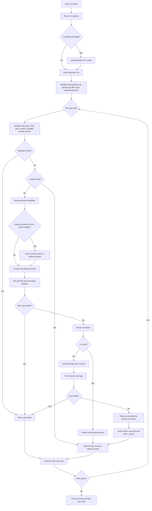
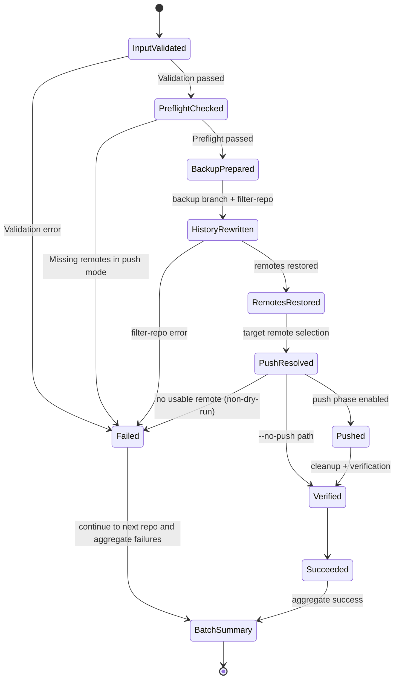

# Remove Cursor Co-Author from Git History

`remove-cursor-coauthor.sh` removes `Co-authored-by: Cursor <cursoragent@cursor.com>` trailers from commit messages using `git-filter-repo`.

It supports single-repo and batch runs, JSON config defaults, dry-run and validate-only modes, and optional push backup remotes.

## Requirements

- **bash**
- **git**
- **git-filter-repo**
- **python3** (for JSON config and JSON repos file)

Install `git-filter-repo` (macOS):

```bash
brew install git-filter-repo
```

Tip: use `--validate-only` first to verify inputs without rewriting or pushing.

## Usage

```text
remove-cursor-coauthor.sh [OPTIONS] [<url> <path> ...]
remove-cursor-coauthor.sh [OPTIONS] --repos-file <file>
remove-cursor-coauthor.sh [OPTIONS] --config <config.json>
```

| Option | Description |
| --- | --- |
| `--dry-run` | Print commands, do not run them |
| `--no-push` | Rewrite history locally only; do not push |
| `--force-push` | When pushing, use `--force` (default) |
| `--no-force-push` | When pushing, do not use `--force` |
| `--validate-only` | Run all checks but do not rewrite or push |
| `--quiet`, `-q` | Minimal output: one line per repo (pass/fail) |
| `--verbose`, `-v` | Show every git command (default) |
| `--config <file>` | Load defaults and optionally repos from JSON |
| `--repos-file <file>` | Process repos from file (see below) |
| `--backup-remote <name>` | Before rewriting, push current branch to this remote (skipped if `--dry-run` or `--no-push`) |
| `--version` | Print version and exit |
| `--help` | Show help |

Repo input:

- **Positional:** Pairs of `<github_repo_url>` and `<absolute_local_repo_path>`.
- **`--repos-file`:** File with one `url path` per line (URL is first token, rest of line is path), or JSON array `[ {"url": "...", "path": "..."}, ... ]`.
- **`--config`:** JSON file with optional `defaults` and optional `repos` array.

URL formats accepted: `https://github.com/<user>/<repo>`, `git@github.com:<user>/<repo>`, `ssh://git@github.com/<user>/<repo>` (with or without `.git`).

## Config JSON

Example config: [remove-cursor-coauthor.example.json](remove-cursor-coauthor.example.json)
Schema: [remove-cursor-coauthor.schema.json](remove-cursor-coauthor.schema.json)

```json
{
  "defaults": {
    "dryRun": false,
    "noPush": false,
    "forcePush": true,
    "backupRemote": "backup"
  },
  "repos": [
    { "url": "https://github.com/user/repo1", "path": "/path/to/repo1" },
    { "url": "git@github.com:user/repo2.git", "path": "/path/to/repo2" }
  ]
}
```

- `defaults`: optional `dryRun`, `noPush`, `forcePush` (booleans), `backupRemote` (string).
- `repos`: optional array of `{ "url": "...", "path": "..." }`.
- If `--config` is passed more than once, the **last one wins** for both defaults and repos.

## Examples

Single repo (default force push):

```bash
./remove-cursor-coauthor.sh https://github.com/user/repo /path/to/repo
```

Local-only rewrite:

```bash
./remove-cursor-coauthor.sh --no-push https://github.com/user/repo /path/to/repo
```

Dry-run:

```bash
./remove-cursor-coauthor.sh --dry-run https://github.com/user/repo /path/to/repo
```

Validate-only:

```bash
./remove-cursor-coauthor.sh --validate-only https://github.com/user/repo /path/to/repo
```

Batch from config:

```bash
./remove-cursor-coauthor.sh --config remove-cursor-coauthor.json
```

## How It Works



## Repository Processing Lifecycle



## Important / Caveats

- **History rewrite:** This rewrites commit history; default mode force-pushes.
- **Backup:** The in-repo backup branch is not a full backup. Use an external clone or remote backup.
- **Push precheck:** In push mode, at least one remote must exist or the script fails before rewrite.
- **Branch required:** Detached HEAD is rejected.
- **Remotes:** `git-filter-repo` removes remotes; script restores remote URLs only (not custom refspecs or `pushurl`).
- **Push target remote order:** URL match, else `origin` if present, else first available remote.
- **`--validate-only`:** No rewrite and no push; `git-filter-repo` is not required.
- **Exit codes:** `0` if all repos succeeded, `1` if any failed.

## Manual Release Process

1. Run full checks (`bash -n`, `shellcheck`, `jq` validation, smoke tests).
2. Bump `VERSION` in `remove-cursor-coauthor.sh`.
3. Commit release-prep changes.
4. Create annotated tag (for example `v1.2.1`).
5. Publish GitHub release manually with concise notes and history-rewrite caveat.

## License

MIT. See [LICENSE](LICENSE).

## See also

- [SECURITY_AND_QUALITY.md](SECURITY_AND_QUALITY.md)
